<div align="center">

# 🏙️ SmartLive Admin — 商家端与平台管理后台

**SmartLive 智评生活 · Vue 2 + Element UI 运营后台（商家经营 + 平台治理）**

[](https://vuejs.org/)
[](https://element.eleme.cn/)
[](https://echarts.apache.org/)
[](https://nodejs.org/)
[](./LICENSE)

📚 在线文档： [SmartLive 在线文档](https://mumulinya.github.io/smartLive-Cloud/) · [视觉导览](https://mumulinya.github.io/smartLive-Cloud/SHOWCASE) · [页面导览](https://mumulinya.github.io/smartLive-Cloud/PAGE_GALLERY) · [开源接入](https://mumulinya.github.io/smartLive-Cloud/OPEN_SOURCE)

</div>

## 📦 项目仓库矩阵

| 仓库 | 说明 | 链接 |
|:---:|:---:|:---:|
| **smartLive-Cloud** | 后端主仓库与在线总文档 | [GitHub](https://github.com/mumulinya/smartLive-Cloud) |
| **smartLive-web** | 用户端 App（Vue 移动端 / H5 页面） | [GitHub](https://github.com/mumulinya/smartLive-web.git) |
| **smartLive-admin** | 商家端与平台管理后台（本仓库） | [GitHub](https://github.com/mumulinya/smartLive-admin.git) |

## 🎨 效果预览

| 经营总览 | 店铺管理 | 商品管理 |
|:---:|:---:|:---:|
| 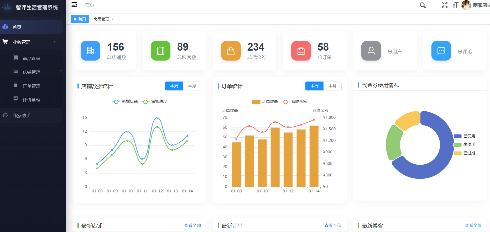 | 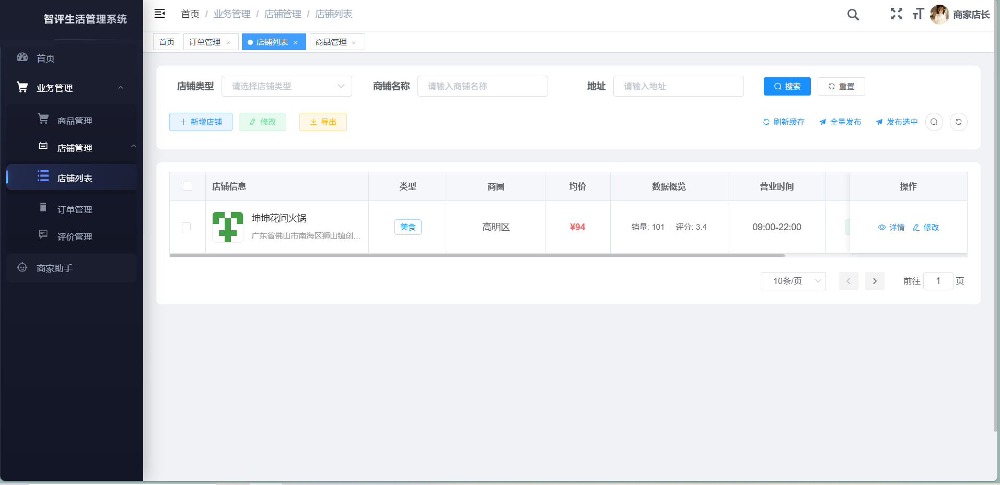 | 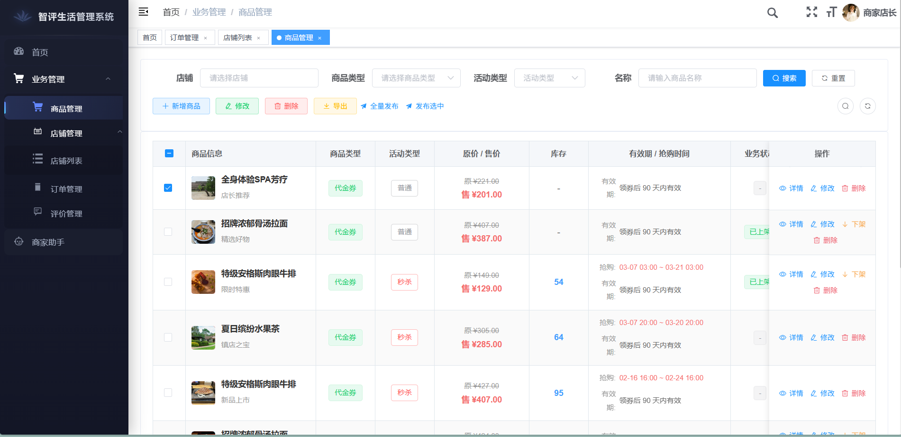 |
| **订单管理** | **订单详情** | **AI 商家助手** |
| 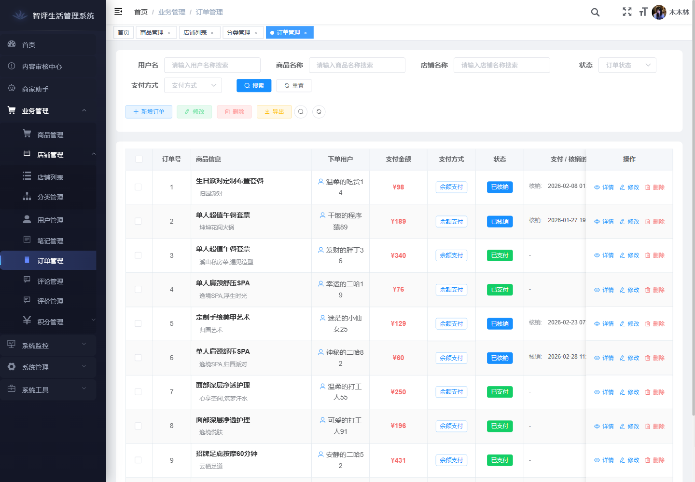 | 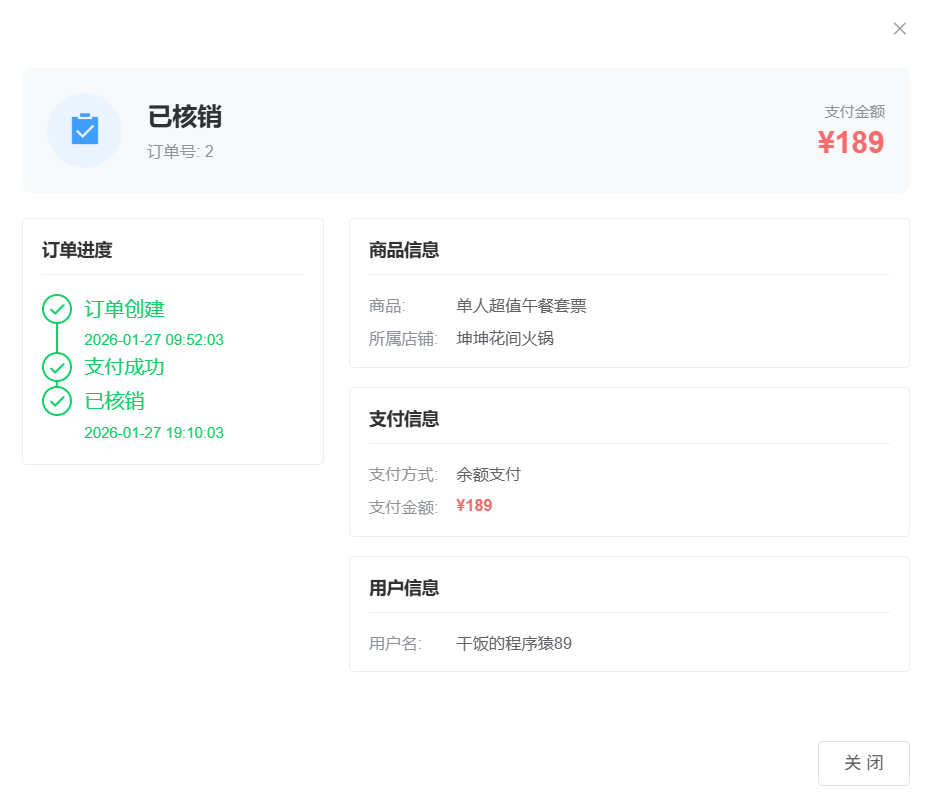 | 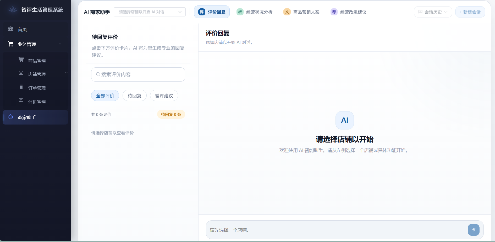 |
| **审核中心** | **博客管理** | **评价管理** |
| 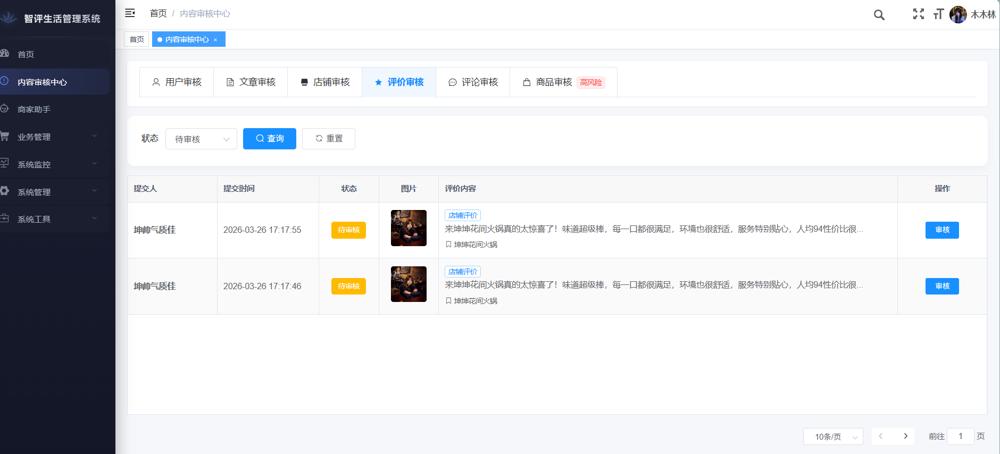 | 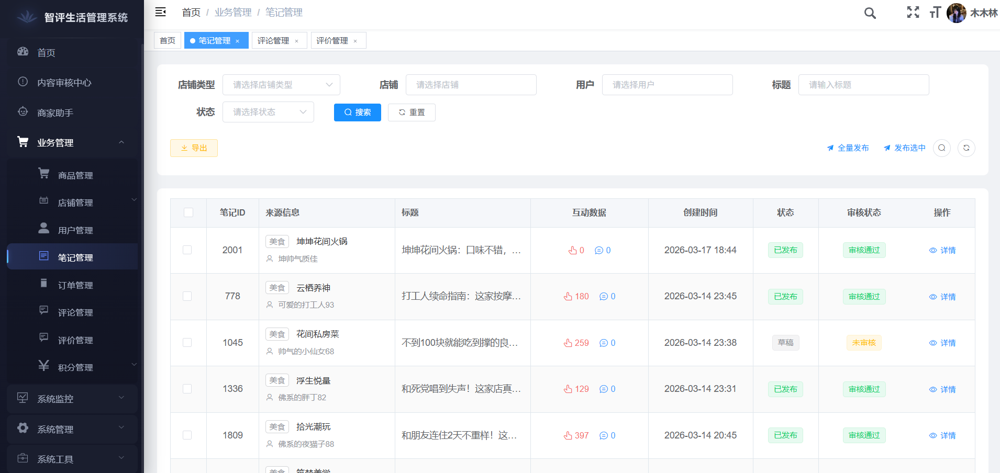 | 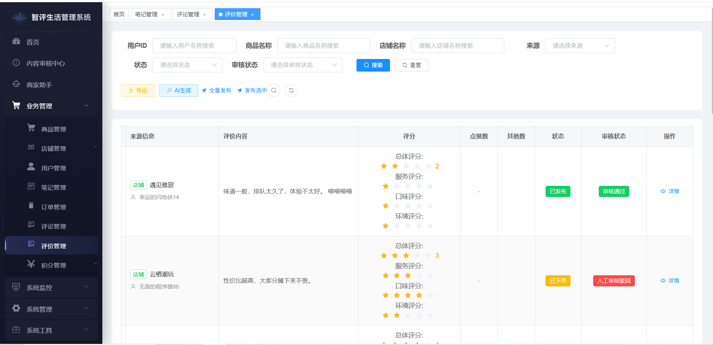 |
| **业务用户** | **业务用户详情** | **积分明细** |
| 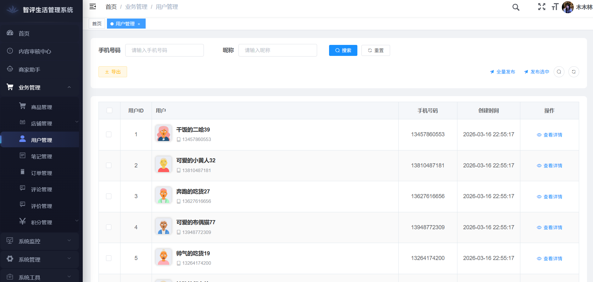 | 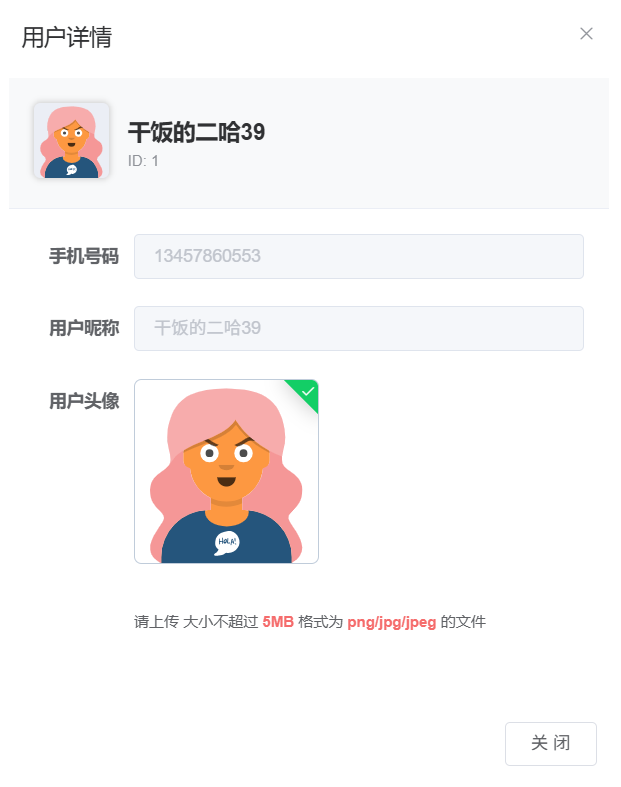 | 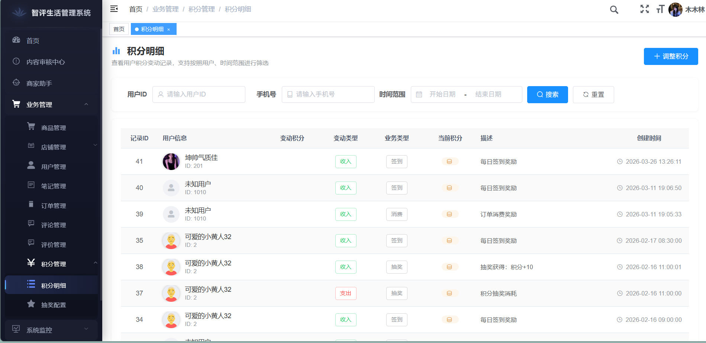 |

推荐阅读顺序：商家端经营总览 -> 店铺与商品经营 -> 订单履约与详情 -> AI 经营助手 -> 平台审核中心 -> 博客/评论/评价治理 -> 业务用户 -> 积分明细与抽奖配置。

## 🖼️ 页面截图索引

| 分组 | 内容说明 | 入口 |
|:---|:---|:---|
| 商家端 Web 页面走查 | 经营总览、店铺管理、商品管理、订单履约、商家助手等链路展示 | [SHOWCASE](https://mumulinya.github.io/smartLive-Cloud/SHOWCASE) |
| 平台管理端页面走查 | 审核中心、博客管理、评论管理、评价管理、业务用户、积分配置等治理页面 | [SHOWCASE](https://mumulinya.github.io/smartLive-Cloud/SHOWCASE) |
| 后台页面映射 | 商家端与管理端页面名称、分组与截图索引总表 | [PAGE_GALLERY](https://mumulinya.github.io/smartLive-Cloud/PAGE_GALLERY) |
| 当前仓库截图目录 | README 已同步的后台代表页面截图资源 | [docs/images](./docs/images) |

- 后台主分组可对照：商家端经营总览、店铺与商品配置、订单履约与详情、商家助手、审核中心、博客/评论/评价治理、业务用户、积分明细与抽奖配置。

## 📋 文档导航

- [页面截图索引](#页面截图索引)
- [项目定位](#项目定位)
- [项目亮点](#项目亮点)
- [功能模块](#功能模块)
- [技术栈](#技术栈)
- [快速开始](#快速开始)
- [环境变量](#环境变量)
- [项目结构](#项目结构)
- [相关文档](#相关文档)
- [常见问题](#常见问题)
- [参与贡献](#参与贡献)
- [开源协议](#开源协议)

## 📖 项目定位

 SmartLive Admin 是 SmartLive 智评生活平台的运营管理后台，基于 **RuoYi-Vue** 二次开发，覆盖 **店铺、商品、订单、笔记、评论、评价、业务用户、积分、审核、商家助手、系统管理** 等完整业务链路。采用动态权限路由，菜单与按钮权限由后端返回，前端按权限动态渲染。

## 🎯 项目亮点

- 🔐 **动态权限路由** — 菜单与按钮权限后端返回，前端按权限动态加载，支持数据权限控制
- 🏪 **业务全覆盖** — 店铺/商品/订单/笔记/评论/评价/业务用户/审核/积分/商家助手全链路覆盖
- 📊 **数据可视化** — ECharts 5 驱动首页看板，KPI 卡片 + 趋势图 + 最新动态
- 🛡️ **多业务审核** — 统一审核中心，支持用户/文章/店铺/评价/评论/商品等内容治理
- 🎁 **积分运营** — 积分流水查询 + 手动加减 + 抽奖奖品配置（概率/库存/上下架）
- 🤖 **AI 商家助手** — 评价回复、经营状况分析、商品营销文案、经营改进建议
- 🔧 **开发工具** — 拖拽式表单构建 + 数据库表一键代码生成
- 📝 **富文本编辑** — Quill 2 富文本编辑器，支持图文混排
- ⚙️ **工程化** — 环境隔离、代理转发、Gzip 压缩、代码分包、RSA 加密

## ✨ 功能模块

### 🏠 认证与首页

| 功能 | 说明 |
|:---|:---|
| 登录 | 验证码 + RSA 密码加密登录、Token 鉴权 |
| 注册 | 用户注册 |
| 首页看板 | KPI 卡片、ECharts 趋势图、最新动态 |
| 个人中心 | 资料维护、头像裁剪上传、密码修改 |

### 🛍️ 业务管理

| 功能 | 说明 |
|:---|:---|
| 店铺管理 | 列表筛选、新增/编辑、地图选点、图片上传、详情弹层、缓存刷新、审核发布 |
| 商品管理 | 列表筛选、新增/编辑、详情弹层、代金券/团购/秒杀切换、库存管理、有效期、批量发布 |
| 订单管理 | 列表筛选、支付方式过滤、履约状态追踪、订单详情弹层、核销状态展示 |
| 笔记/博客管理 | 列表查询、标题/用户/店铺筛选、详情弹层、互动数据与状态审核 |
| 评论管理 | 来源过滤、状态/审核状态控制、评论详情查看 |
| 评价管理 | 评分明细查看、状态/审核状态控制、评价详情查看、AI 生成评价 |
| 业务用户管理 | 列表查询、详情查看、头像资料展示 |
| 商家助手 | AI 主会话、评价回复、经营状况分析、商品营销文案、经营改进建议 |

### ✅ 审核中心

| 功能 | 说明 |
|:---|:---|
| 统一审核 | 支持用户/文章/店铺/评价/评论/商品等业务类型分栏审核 |
| 审核详情 | 提交信息、关联目标、图片内容与详情查看 |
| 审核操作 | 通过/驳回、驳回原因填写 |

### 🎁 积分中心

| 功能 | 说明 |
|:---|:---|
| 积分明细 | 流水查询、时间筛选、用户筛选、业务类型展示 |
| 积分调整 | 管理员手动加减积分并记录备注 |
| 抽奖配置 | 奖品 CRUD、概率设置、库存管理、排序、上下架控制 |

### ⚙️ 系统管理

| 功能 | 说明 |
|:---|:---|
| 用户管理 | CRUD、角色分配、状态管理、重置密码 |
| 角色管理 | CRUD、数据权限、分配用户 |
| 菜单管理 | 菜单/按钮权限配置 |
| 部门管理 | 组织架构树维护 |
| 岗位管理 | 岗位职级配置 |
| 字典管理 | 字典类型与字典数据维护 |
| 参数设置 | 系统参数配置与缓存刷新 |
| 操作日志 | 操作日志记录与查询 |
| 登录日志 | 登录日志、解锁账户、日志清理 |

### 📊 监控中心

| 功能 | 说明 |
|:---|:---|
| 在线用户 | 在线会话监控、强制下线 |
| 定时任务 | 任务 CRUD、启停、立即执行 |
| 调度日志 | 任务执行日志查询 |

### 🔨 开发工具

| 功能 | 说明 |
|:---|:---|
| 表单构建 | 拖拽式表单设计器 |
| 代码生成 | 数据库表导入 → 字段配置 → 预览 → 一键生成前后端代码 |

## 🔧 技术栈

| 类别 | 技术 | 说明 |
|:---|:---|:---|
| 核心框架 | Vue 2.6 | Options API |
| UI 组件 | Element UI 2.15 | 表格/表单/树形/对话框等 |
| 状态管理 | Vuex 3 | 用户/权限/设置模块 |
| 路由 | Vue Router 3 | 动态权限路由 |
| 网络请求 | Axios 0.28 | 统一拦截器 + Token 刷新 |
| 数据可视化 | ECharts 5 | 首页看板图表 |
| 富文本 | Quill 2 | 笔记/博客编辑器 |
| 图片处理 | vue-cropper | 头像裁剪上传 |
| 加密 | jsencrypt | RSA 密码加密 |
| 模糊搜索 | fuse.js | 菜单搜索 |
| 样式预处理 | Sass | SCSS 变量 + 混入 |
| 构建工具 | Vue CLI 4 / Webpack 4 | Gzip 压缩 + 代码分包 |

### 🛠️ 工程化亮点

- 🔐 **权限控制** — `permission.js` 路由守卫 + `v-hasPermi` / `v-hasRole` 自定义指令
- 📦 **22 个通用组件** — 面包屑、分页、文件上传、图片上传/预览、图标选择、Cron 表达式等
- 🎨 **主题定制** — ThemePicker 动态换肤、导航布局切换
- 📋 **字典系统** — DictData / DictTag 封装全局字典选择与展示
- 🔧 **代码生成** — 数据库表直接生成 CRUD 页面 + API 接口
- 🛡️ **安全加固** — RSA 加密传输、XSS 过滤、CSRF Token

## 🚀 快速开始

### 环境要求

| 环境 | 版本要求 |
|:---|:---|
| Node.js | 14.x 或 16.x |
| npm | >= 6 |
| 后端服务 | 默认 `http://localhost:8080` |

### 1. 安装依赖

```bash
npm install --registry=https://registry.npmmirror.com
```

### 2. 启动项目

```bash
npm run dev
```

启动后访问：`http://localhost:80`

### 3. 构建生产包

```bash
# 测试环境
npm run build:stage

# 生产环境
npm run build:prod
```

## 🔑 环境变量

| 文件 | 说明 |
|:---|:---|
| `.env.development` | 开发环境 |
| `.env.staging` | 测试环境 |
| `.env.production` | 生产环境 |

| 变量名 | 说明 | 示例 |
|:---|:---|:---|
| `VUE_APP_TITLE` | 系统标题 | `SmartLive 管理系统` |
| `VUE_APP_BASE_API` | 接口前缀 | `/dev-api/admin` |
| `VUE_APP_FILE_BASE_API` | 文件服务地址 | `http://127.0.0.1:9000` |
| `VUE_FILE_PREFIX` | 文件路径前缀 | `/smart-live` |

> 代理配置：`vue.config.js` → `/dev-api/admin/**` → `http://localhost:8080/admin/**`

## 📁 项目结构

```text
smartLive-ui/
├─ public/                         # 公共静态资源
├─ src/
│  ├─ api/                         # 接口层
│  │  ├─ audit.js                  #   审核接口
│  │  ├─ product.js                #   商品接口
│  │  ├─ blog/                     #   笔记/博客
│  │  ├─ comment/                  #   评论
│  │  ├─ order/                    #   订单
│  │  ├─ points/                   #   积分
│  │  ├─ shop/                     #   店铺
│  │  ├─ user/                     #   APP 用户
│  │  ├─ system/                   #   系统管理
│  │  ├─ monitor/                  #   监控
│  │  └─ tool/                     #   开发工具
│  ├─ assets/                      # 静态资源与样式
│  ├─ components/                  # 通用组件（22 个）
│  │  ├─ Editor/                   #   Quill 富文本编辑器
│  │  ├─ FileUpload/               #   文件上传
│  │  ├─ ImageUpload/              #   图片上传
│  │  ├─ ImagePreview/             #   图片预览
│  │  ├─ Pagination/               #   分页组件
│  │  ├─ DictData/ & DictTag/      #   字典选择与展示
│  │  ├─ IconSelect/               #   图标选择器
│  │  ├─ Crontab/                  #   Cron 表达式
│  │  ├─ ThemePicker/              #   动态换肤
│  │  └─ ...                       #   面包屑/全屏/搜索等
│  ├─ directive/                   # 自定义指令（v-hasPermi / v-hasRole）
│  ├─ layout/                      # 布局框架（侧栏/顶栏/标签页）
│  ├─ plugins/                     # 全局插件注册
│  ├─ router/                      # 路由（静态 + 动态权限路由）
│  ├─ store/                       # Vuex 模块（user/permission/settings/...）
│  ├─ utils/                       # 工具函数
│  │  ├─ request.js                #   Axios 封装（Token/401/错误码）
│  │  ├─ permission.js             #   权限校验工具
│  │  ├─ auth.js                   #   Token 管理
│  │  ├─ jsencrypt.js              #   RSA 加密
│  │  ├─ validate.js               #   表单验证规则
│  │  ├─ smartLive.js              #   业务工具函数
│  │  └─ ...                       #   字典/滚动/错误码等
│  └─ views/                       # 页面模块
│     ├─ business/                 #   业务管理
│     │  ├─ ai/                    #     商家助手
│     │  ├─ shop/                  #     店铺管理
│     │  ├─ product/               #     商品管理（代金券/团购/秒杀）
│     │  ├─ order/                 #     订单管理
│     │  ├─ blog/                  #     笔记/博客管理
│     │  ├─ comment/               #     评论管理
│     │  ├─ review/                #     评价管理
│     │  ├─ user/                  #     业务用户管理
│     ├─ system/                   #   系统管理
│     │  ├─ audit/                 #     审核中心
│     │  ├─ points/                #     积分中心
│     │  ├─ user/ & role/ & menu/  #     系统用户/角色/菜单
│     │  ├─ dept/ & post/          #     部门/岗位
│     │  ├─ dict/ & config/        #     字典/参数
│     │  └─ operlog/ & logininfor/ #     操作日志/登录日志
│     ├─ monitor/                  #   监控中心（在线用户/定时任务）
│     └─ tool/                     #   开发工具（表单构建/代码生成）
├─ .env.development                # 开发环境变量
├─ .env.staging                    # 测试环境变量
├─ .env.production                 # 生产环境变量
├─ vue.config.js                   # Webpack + 代理配置
└─ package.json
```

## 📚 相关文档

- [SmartLive 在线文档](https://mumulinya.github.io/smartLive-Cloud/)
- [后端主仓库 smartLive-Cloud](https://github.com/mumulinya/smartLive-Cloud)
- [开源接入说明](https://mumulinya.github.io/smartLive-Cloud/OPEN_SOURCE)

## ❓ 常见问题

### 1. npm install 报错？
- 使用 Node 14 或 16（不推荐 18+，可能存在 OpenSSL 兼容问题）
- 使用淘宝镜像：`npm install --registry=https://registry.npmmirror.com`

### 2. 接口 404？
- 检查 `vue.config.js` 代理目标是否指向正确的后端地址
- 检查 `.env.development` 中 `VUE_APP_BASE_API` 是否与代理前缀一致

### 3. 菜单不显示？
- 确认后端 `/system/menu/getRouters` 接口返回正确的菜单数据
- 确认当前用户角色拥有菜单权限

### 4. 商家助手页面没有返回内容？
- 先确认已选择店铺，再检查 AI 相关后端服务与业务数据是否正常。
- 重点排查评价、订单、商品等分析数据源是否可用。

## 🤝 参与贡献

欢迎通过 Issue 或 PR 一起完善这个后台仓库。

建议在提交前至少确认：
- 业务页面截图与 README 展示一致
- 涉及权限、菜单、审核流时同步更新说明
- 本地开发环境可正常跑通主要页面

## 📄 开源协议

本项目基于 [MIT License](./LICENSE) 开源。

## 🙏 致谢

- [RuoYi-Vue](https://gitee.com/y_project/RuoYi-Vue) — 基础框架
- [Vue.js](https://vuejs.org/) · [Element UI](https://element.eleme.cn/) · [ECharts](https://echarts.apache.org/)

---

<div align="center">

**如果觉得不错，请给我们一个 ⭐ Star 吧!**

Made with ❤️ by SmartLive Team

</div>
